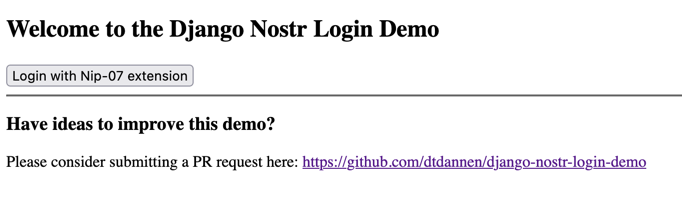
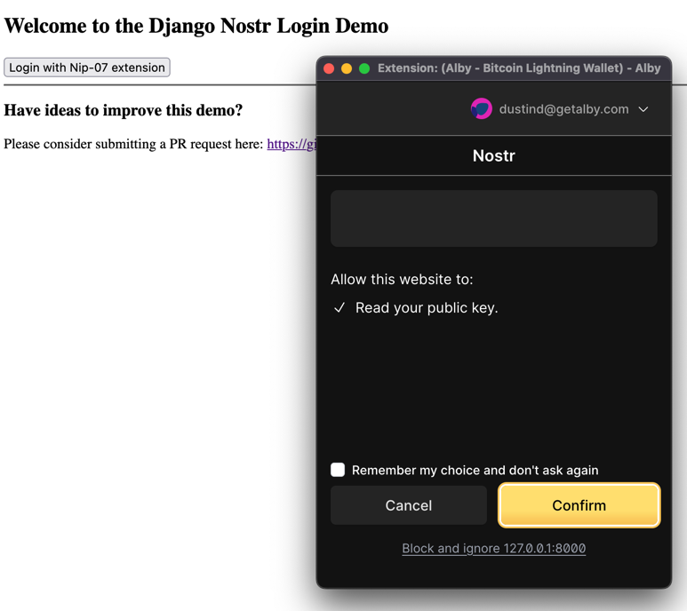
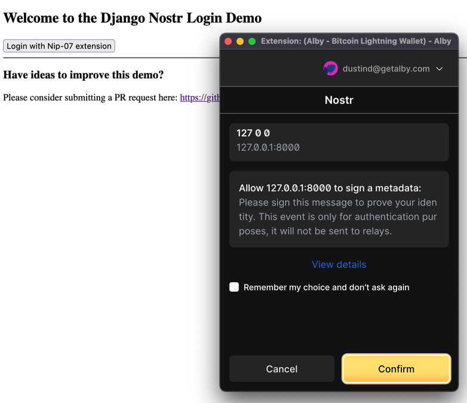
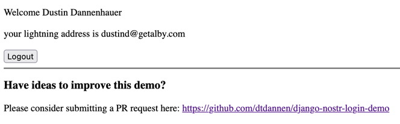

# django-nostr-login-demo
This is a simple demo of how to use Nostr extensions for authentication, using Django's built-in User models. This replaces the traditional username and password method of authentication, and it asks your Nostr extension that manages your secret key so the user never reveals their secret key to the application.

Note: Please submit a PR if you can improve this!

### Pre-login Screen



### First popup gets user's public key



### Second popup has user sign a message 



### Then the user is logged in



# Install

Get the repo:

```commandline
git clone https://github.com/dtdannen/django-nostr-login-demo.git
cd django-nostr-login-demo
```

Set up your virtualenv

```commandline
python3 -m venv venv
```

Install requirements

```commandline
pip install -r requirements.txt
```

# Get a Nostr Browser Extension for maintaining your keys

[Alby](https://getalby.com/) is an easy one to start with - see here for a more complete list: [https://github.com/nostr-protocol/nips/blob/master/07.md](https://github.com/nostr-protocol/nips/blob/master/07.md)

Make sure to create a Nostr account under your Alby account

# Run

Go to the top level django directory:

```commandline
cd nostrlogindemo
```

The first time you run it, you'll need to migrate the database:


```commandline
python manage.py migrate
```

Then run the server and visit http://127.0.0.1:8000/

```commandline
python manage.py runserver
```

Then click the Login button and a window should pop up from your Nostr extension, letting you sign an event with your private key to prove you are your public key!

# Author

npub1mgvwnpsqgrem7jfcwm7pdvdfz2h95mm04r23t8pau2uzxwsdnpgs0gpdjc